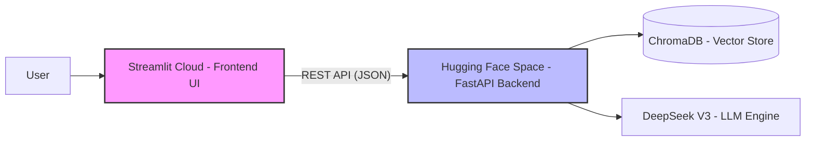

# 🤖 DocuMate: Industrial-Grade RAG Document Intelligence


DocuMate is a professional document analysis assistant powered by RAG (Retrieval-Augmented Generation) architecture. Adhering to the strict principle of "No context, no answer," it generates responses by extracting facts exclusively from user-uploaded PDFs combined with the DeepSeek-V3 LLM. If the required information is not found within the document, the system will honestly inform the user, effectively eliminating the common "hallucination" issues associated with large language models.

---

## 🏗️ System Architecture



## 🏗️ Technical Stack

* **Frontend**: **Streamlit** (Enhanced with **Custom CSS Injection** for 100% UI localization).
* **Backend**: **Python / FastAPI** (Asynchronous processing for high-concurrency document ingestion).
* **LLM Engine**: **DeepSeek-V3** (Accessed via OpenAI-compatible API) — leverages state-of-the-art reasoning for natural language generation.
* **Embedding Model**: **HuggingFace** (`sentence-transformers/all-MiniLM-L6-v2`) — Localized execution for data privacy and zero API costs.
* **Vector Database**: **ChromaDB** — Persistent storage for high-precision semantic retrieval.
* **Orchestration**: **LangChain** (RecursiveCharacterTextSplitter, PyMuPDFLoader).
* **Theming**: Configuration-driven via `.streamlit/config.toml` (Primary Color: `#4F46E5`).
* **Containerization**: **Docker** (Multi-stage builds implemented to optimize image size and deployment efficiency).
* **Deployment**: **Distributed Architecture** (Frontend hosted on **Streamlit Cloud**, Backend engine on **Hugging Face Spaces** via FastAPI).

---

## 🛠️ Engineering Challenges Solved

### 1. State-Driven UI Synchronization
Solved the "Label Lag" issue where UI labels wouldn't sync immediately after a language switch. By utilizing `st.session_state` pre-calculation, the interface now responds instantly with correct localized headers.

### 2. Overcoming Framework Constraints (Deep Customization)
Streamlit's native `file_uploader` has hardcoded English prompts. I implemented **CSS Pseudo-element Hijacking** to force-translate internal strings like "Drag and drop", ensuring a seamless 100% Chinese experience.

### 3. Reliability via Mirroring
Configured `HF_ENDPOINT` mirroring to ensure stable model downloads and 100% service uptime in restricted network environments.

---

## 🌟 Key Highlights

* **Zero-Hardcoding Architecture**: Fully driven by configuration files and localized dictionaries for maximum maintainability.
* **Fact-Checking & Traceability**: Automated citation system (📍 原始文本参考) that links every AI response back to the specific document page numbers.
* **Language-Adaptive Intelligence**: Engineered a zero-shot language detection prompt that ensures the assistant's response language strictly matches the user's input.

---


## 🚀 Usage

### Option A: Online Demo (Recommended)
[Click here to access the Live Demo](https://docu-mate-ai.streamlit.app)

### Option B: Local Development
If you wish to study the source code or run the application in a local environment, please follow these steps:

1.  **Clone the Repository**:
    ```bash
    git clone [https://github.com/Seleneplus/DocuMate.git](https://github.com/Seleneplus/DocuMate.git)
    cd DocuMate
    ```
2.  **Set Up Virtual Environment**：
    It is highly recommended to use a virtual environment to avoid dependency conflicts:
    ```bash
    # Create the virtual environment
    python -m venv venv

    # Activate it (Windows)
    .\venv\Scripts\activate

    # Activate it (Mac/Linux)
    source venv/bin/activate
    ```
3.  **Install Dependencies**:
    Ensure you have Python installed, then run:
    ```bash
    pip install -r requirements.txt
    ```
4.  **Configure Environment Variables**:
    Create a `.env` file in the root directory and add your DeepSeek API credentials:
    ```env
    OPENAI_API_KEY=your_deepseek_api_key
    OPENAI_API_BASE=[https://api.deepseek.com/v1](https://api.deepseek.com/v1)
    LLM_MODEL=deepseek-chat
    ```
5.  **Run the Application**:
    ```bash
    streamlit run app.py
    ```
